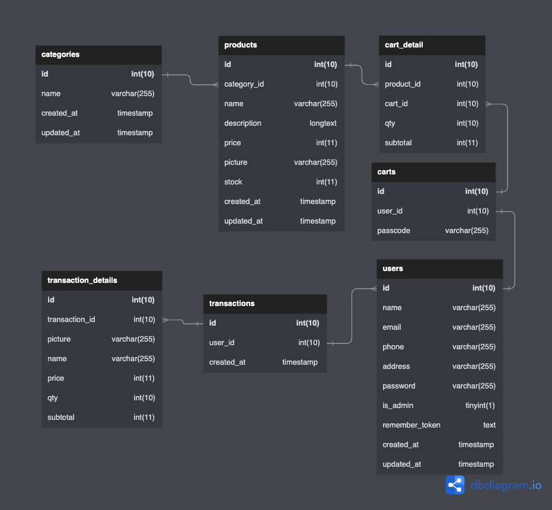

<p align="center"></p>

## Getting Started
### Run Locally

**Prequirements**
- PHP
- MySQL database
- Composer

1. Install packages
    ```shell
    composer install --ignore-platform-reqs
    composer update # optional
    ```
2. Copy [`.env.example`](.env.example) to `.env`
3. Change `DB_DATABASE` , `DB_USERNAME`, and `DB_PASSWORD` in `.env` to match your environment
4. Create a new mysql database with name matching `DB_DATABASE`
5. Link storage
    ```shell
    php artisan storage:link
    ```
6. Run migration and seeder
    ```shell
    php artisan migrate:fresh --seed
    ```
7. Start the web server
    ```shell
    php artisan serve
    ```
8. Open http://localhost:8000 on your preferred browser.

### Developing Locally

**Prequirements**
- PHP
- MySQL database
- Composer
- Node v16+
1. Install packages
    ```shell
    composer install --ignore-platform-reqs
    composer update
    npm install
    ```
2. Copy [`.env.example`](.env.example) to `.env`
3. Create a new mysql database name **baktify**
4. Link storage
    ```shell
    php artisan storage:link
    ```
5. Run migration and seeder
    ```shell
    php artisan migrate:fresh --seed
    ```
6. To run both assets bundler and web server, open 2 different terminals and run:
    ```shell
    npm run dev
    ```
    ```shell
    php artisan serve
    ```

## Related
### Entity Relationship Diagram


### References
- https://unsplash.com/photos/rt8nASaIQZA?utm_source=unsplash&utm_medium=referral&utm_content=creditShareLink
- https://avatars.dicebear.com/
- https://getbootstrap.com/docs/5.1/getting-started/introduction/
- https://storyset.com/technology
- https://storyset.com/work
- https://getbootstrap.com/docs/5.0/about/brand/ 
